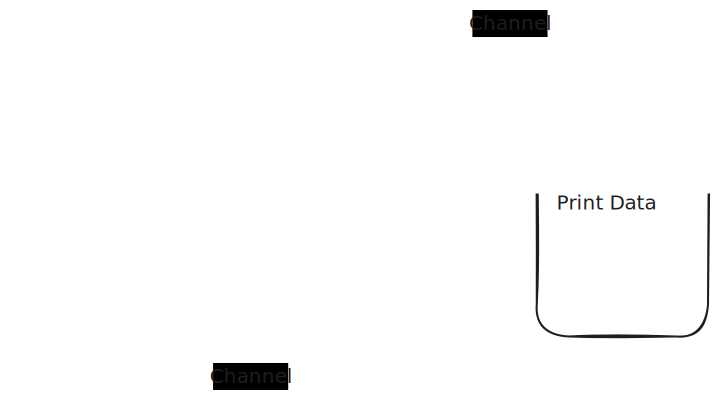

SQLite clone built with Go's awesome concurrency model.

Codecrafters progress banner

## Features Implemented

- Print page size, number of tables and table names
- Count rows in a table
- Read data from a single column
- Read data from multiple columns
- Filter data with a WHERE clause
- Retrieve data using a full-table scan
- Scan database concurrently, resulting in high performance

## Architecture

Each page on disk is deserialized and printed as soon as they are read, resulting in lower query time
